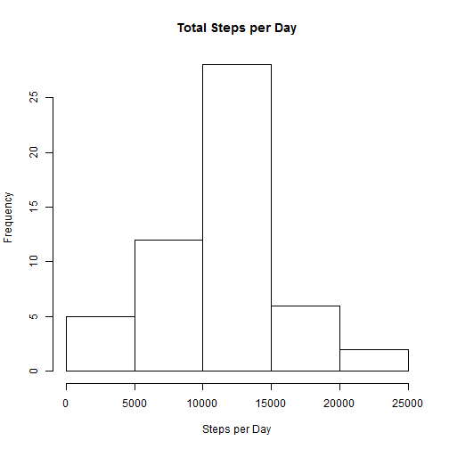
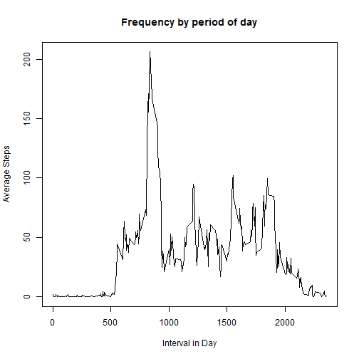
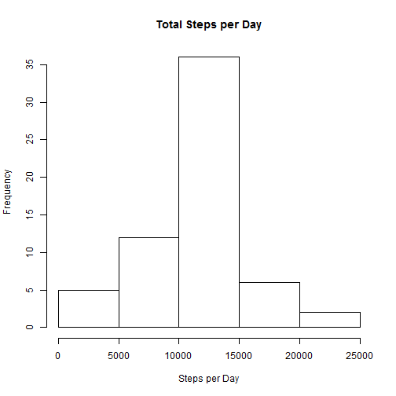
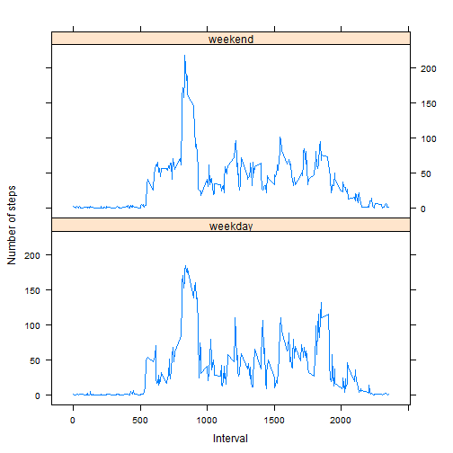

This document addresses all the analysis requested for Peer Assessment 1 for the Reproducible Reesarch module of the Data Sepecilaization.

If you want to run the code, assumption is that you have downloaded the source data
from `https://d396qusza40orc.cloudfront.net/repdata%2Fdata%2Factivity.zip`, unzipped
the zip file `repdata_data_activity.zip` so the raw data `activity.csv` can be loaded.

## Loading and preprocessing the data

First thing is to load the source data into an R environment.
Note variable name PAMD is an acronym for Personal Activity Monitoring Device.
Then turn "date" into a real date column.
Then have a version with the 2304 lines with NA is the steps column ripped out,
this is handy for values we won't impute.


```r
PAMD <- read.csv("activity.csv")
PAMD$date <- as.Date(PAMD$date)
PAMD_noNA <- na.omit(PAMD)
```


## What is mean total number of steps taken per day?

A histogram is required with total steps per day, on non-NA data.
Use sqldf as an easy to read way to accumulate this summary.


```r
library(sqldf)
```

```
## Loading required package: gsubfn
## Loading required package: proto
## Loading required package: RSQLite
## Loading required package: DBI
```

```r
PAMD_Steps <- sqldf("select date, sum(steps) as Total from PAMD_noNA group by date")
```

```
## Loading required package: tcltk
```


```r
hist(PAMD_Steps$Total, main="Total Steps per Day", xlab="Steps per Day")
```

 

Overall Mean and Median (compare after imputing)


```r
AveragesWithNA <- c(mean(PAMD_Steps$Total), median(PAMD_Steps$Total))
names(AveragesWithNA) <- c("Mean", "Median")
AveragesWithNA
```

```
##     Mean   Median 
## 10766.19 10765.00
```

## What is the average daily activity pattern?

Plot average of each 5 min time interval per day.


```r
PAMD_Avg <- sqldf("select interval, avg(steps) as Average from PAMD_noNA group by interval")

plot(PAMD_Avg$interval, PAMD_Avg$Average, type="l", main="Frequency by period of day", 
     xlab="Interval in Day", ylab = "Average Steps")
```

 

## Imputing missing values

So how many NA's do we have anyway?


```r
NAReport <- c(sum(is.na(PAMD$steps)), sum(!is.na(PAMD$steps)))
names(NAReport) <- c("Number Missing", "Number Complete")
NAReport
```

```
##  Number Missing Number Complete 
##            2304           15264
```

Given we have averages per interval above, we can perform a simple scheme to
impute the missing values with the average for that interval in the day.


```r
NAsToImpute <- is.na(PAMD$steps)
PAMD_NA <- PAMD[NAsToImpute, ]
PAMDImpute <- merge(PAMD_Avg, PAMD_NA, by = c("interval"))[,c(2,4,1)]
colnames(PAMDImpute)[1] <- "steps"
PAMDImpute$steps <- round(PAMDImpute$steps)
PAMDImpute <- rbind(PAMDImpute, PAMD[!NAsToImpute, ])
```

Imputed Mean and Median (compare after imputing)


```r
PAMDImputeSteps <- sqldf("select date, sum(steps) as Total from PAMDImpute group by date")
hist(PAMDImputeSteps$Total, main="Total Steps per Day", xlab="Steps per Day")
```

 

```r
AveragesWithImpute <- c(mean(PAMDImputeSteps$Total), median(PAMDImputeSteps$Total))
names(AveragesWithImpute) <- c("Mean", "Median")
AveragesWithImpute
```

```
##     Mean   Median 
## 10765.64 10762.00
```

## Are there differences in activity patterns between weekdays and weekends?

Let's use the base weekdays function to set a new factor to denote if day of week is a Weekend or a Weekday.


```r
weekdaysVector <- c('Monday', 'Tuesday', 'Wednesday', 'Thursday', 'Friday')
PAMDImpute$PartOfWeek <- factor((weekdays(PAMDImpute$date) %in% weekdaysVector)+1L, levels=1:2, labels=c('weekday', 'weekend'))
```

Now let's plot these 


```r
library(lattice)
PAMDImputeAvg <- sqldf("select PartOfWeek, interval, avg(steps) as Average from PAMDImpute group by PartOfWeek, interval")
xyplot(Average ~ interval | PartOfWeek, data = PAMDImputeAvg, layout = c(1,2), type = "l", xlab = "Interval", ylab = "Number of steps")
```

 


